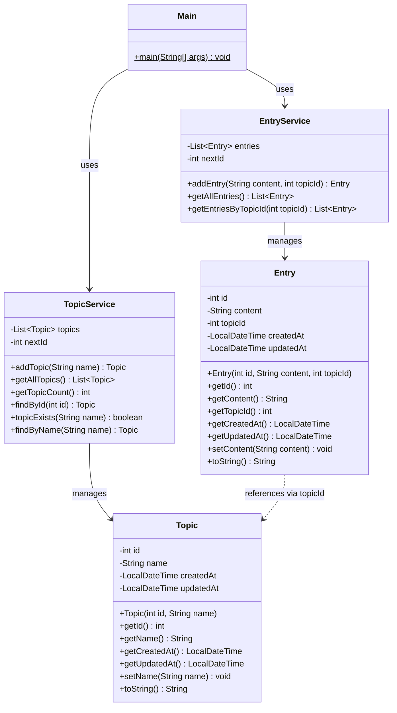
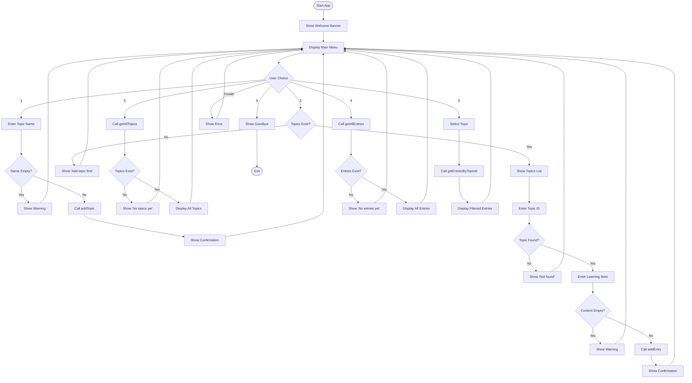
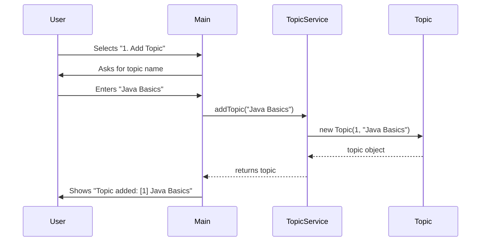
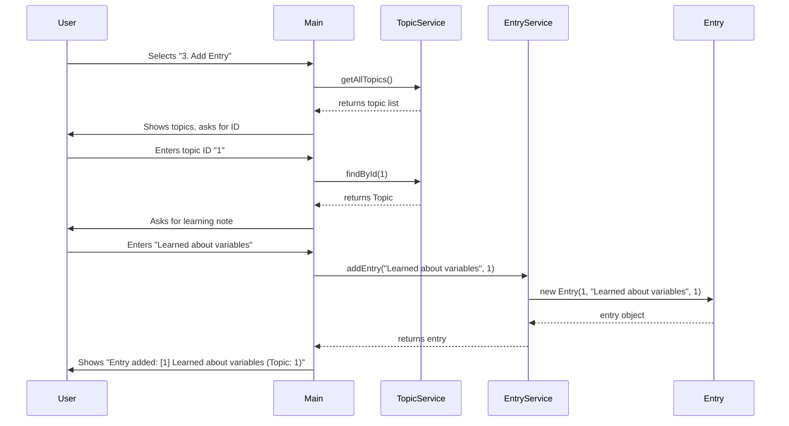

# Learning Logs Terminal — Workshop

### Week 1 — Workshop: Topics + Entries

> *"The more you log, the more you learn."*

---

## Quest Overview

You are building a **terminal-based Learning Logs application** in Java. This app helps you track the topics you're learning and write journal entries about each topic.

Your mission: **complete all 15 TODOs** across 4 files to make the app fully functional. Push further with **bonus TODOs** for extra XP!

```
╔══════════════════════════════════════════╗
║     Welcome to Learning Logs Terminal    ║
║     Track what you learn, level up!      ║
╚══════════════════════════════════════════╝

┌──────────────────────────────┐
│         MAIN MENU            │
├──────────────────────────────┤
│  1. Add a new Topic          │
│  2. View all Topics          │
│  3. Add an Entry             │
│  4. View all Entries         │
│  5. View Entries by Topic    │
│  6. Exit                     │
└──────────────────────────────┘
Choose an option (1-6):
```

---

## XP System

Earn **XP** by completing each TODO. Collect all **460 XP** to master this quest!

### Task 1: Topics (180 XP)

| TODO | Task | XP | File |
|------|------|----|------|
| 1 | Declare Topic fields | 40 XP | `Topic.java` |
| 2 | Create Topic constructor | 20 XP | `Topic.java` |
| 3 | Create Topic getters & setters | 30 XP | `Topic.java` |
| 4 | Override Topic `toString()` | 20 XP | `Topic.java` |
| 5 | Implement `addTopic()` | 30 XP | `TopicService.java` |
| 6 | Implement `getAllTopics()` | 20 XP | `TopicService.java` |
| 7 | Implement `getTopicCount()` | 20 XP | `TopicService.java` |

### Task 2: Entries (190 XP)

| TODO | Task | XP | File |
|------|------|----|------|
| 8 | Implement `findById()` | 20 XP | `TopicService.java` |
| 9 | Declare Entry fields | 50 XP | `Entry.java` |
| 10 | Create Entry constructor | 20 XP | `Entry.java` |
| 11 | Create Entry getters & setters | 30 XP | `Entry.java` |
| 12 | Override Entry `toString()` | 20 XP | `Entry.java` |
| 13 | Implement `addEntry()` | 30 XP | `EntryService.java` |
| 14 | Implement `getAllEntries()` | 20 XP | `EntryService.java` |

### Bonus (90 XP)

| TODO | Task | XP | File |
|------|------|----|------|
| 15 | Implement `getEntriesByTopicId()` | 30 XP | `EntryService.java` |
| 16 | Prevent duplicate topic names | 30 XP | `TopicService.java` |
| 17 | Case-insensitive topic search | 30 XP | `TopicService.java` |

| | **TOTAL** | **460 XP** | |

### Achievement Badges

| Badge | Name | How to Earn |
|-------|------|-------------|
| 🏛️ | **Architect** | Complete Topic entity (TODO 1–4) |
| ⚙️ | **Engineer** | Complete TopicService (TODO 5–8) |
| 📝 | **Scribe** | Complete Entry entity (TODO 9–12) |
| 🔧 | **Builder** | Complete EntryService (TODO 13–14) |
| ⭐ | **Master** | Complete all Bonus TODOs (15–17) + app runs end-to-end |

---

## Project Structure

```
src/main/java/com/learninglogsterminal/
├── Main.java              ← PROVIDED (don't modify)
├── entity/
│   ├── Topic.java         ← YOUR WORK (TODO 1–4)
│   └── Entry.java         ← YOUR WORK (TODO 9–12)
└── service/
    ├── TopicService.java  ← YOUR WORK (TODO 5–8, BONUS 16–17)
    └── EntryService.java  ← YOUR WORK (TODO 13–14, BONUS 15)
```

---

## Class Diagram



---

## Application Flow



---

## How It Works — Adding a Topic



---

## How It Works — Adding an Entry



---

## Getting Started

### Step 1: Open the Project
Open this project in **IntelliJ IDEA** (or your preferred IDE).

### Step 2: Understand the Code
Read through `Main.java` first — it shows you how the app works and what methods it expects from your code.

### Step 3: Complete the TODOs
Work through the TODOs **in order** (1 → 15). Each TODO has:
- A description of what to do
- A hint to help you

### Recommended Order:
1. **Topic.java** (TODO 1–4) → get topics working first
2. **TopicService.java** (TODO 5–8) → test with menu options 1 & 2
3. **Entry.java** (TODO 9–12) → build the entry entity
4. **EntryService.java** (TODO 13–15) → test with menu options 3, 4 & 5

### Step 4: Run the App
Run `Main.java` and test your app!

---

## Expected Output

```
╔══════════════════════════════════════════╗
║     Welcome to Learning Logs Terminal    ║
║     Track what you learn, level up!      ║
╚══════════════════════════════════════════╝

Choose an option (1-6): 1
Enter topic name: Java Basics
✓ Topic added: [1] Java Basics (Created: 2026-02-21T10:30:00)
  Total topics: 1

Choose an option (1-6): 1
Enter topic name: OOP Concepts
✓ Topic added: [2] OOP Concepts (Created: 2026-02-21T10:30:15)
  Total topics: 2

Choose an option (1-6): 3

── Select a Topic ───────────────
  [1] Java Basics (Created: 2026-02-21T10:30:00)
  [2] OOP Concepts (Created: 2026-02-21T10:30:15)
─────────────────────────────────
Enter topic ID: 1
Enter your learning note: Learned about variables and data types
✓ Entry added: [1] Learned about variables and data types (Topic: 1)
  Under topic: Java Basics

Choose an option (1-6): 3

── Select a Topic ───────────────
  [1] Java Basics (Created: 2026-02-21T10:30:00)
  [2] OOP Concepts (Created: 2026-02-21T10:30:15)
─────────────────────────────────
Enter topic ID: 1
Enter your learning note: Practiced if-else statements
✓ Entry added: [2] Practiced if-else statements (Topic: 1)
  Under topic: Java Basics

Choose an option (1-6): 4

── All Entries ──────────────────
  [1] Learned about variables and data types (Topic: 1)
  [2] Practiced if-else statements (Topic: 1)
─────────────────────────────────

Choose an option (1-6): 5

── Select a Topic ───────────────
  [1] Java Basics (Created: 2026-02-21T10:30:00)
  [2] OOP Concepts (Created: 2026-02-21T10:30:15)
─────────────────────────────────
Enter topic ID: 1

── Entries for: Java Basics ──
  [1] Learned about variables and data types (Topic: 1)
  [2] Practiced if-else statements (Topic: 1)
─────────────────────────────────

Choose an option (1-6): 6

Happy Learning! See you next time.
```

---

## Test Cases

| # | Action | Input | Expected Result |
|---|--------|-------|-----------------|
| 1 | Add topic | `Java Basics` | `✓ Topic added: [1] Java Basics (Created: ...)` |
| 2 | Add topic | `OOP Concepts` | `✓ Topic added: [2] OOP Concepts (Created: ...)` |
| 3 | View topics | — | Lists both topics |
| 4 | Add entry (no topics) | — | `No topics yet. Add a topic first!` |
| 5 | Add entry | Topic ID: `1`, Note: `Learned variables` | `✓ Entry added: [1] Learned variables (Topic: 1)` |
| 6 | Add entry (bad ID) | Topic ID: `99` | `⚠ Topic not found with ID: 99` |
| 7 | Add entry (not a number) | Topic ID: `abc` | `⚠ Please enter a valid number!` |
| 8 | View all entries | — | Lists all entries |
| 9 | View entries by topic | Topic ID: `1` | Lists only entries for topic 1 |
| 10 | Exit | `6` | `Happy Learning! See you next time.` |
| **Bonus** | | | |
| 11 | Add duplicate topic | `Java Basics` added twice | Duplicate topic is not allowed |
| 12 | Case-insensitive search | `programming` vs `Programming` | Topic is matched correctly |

---

## XP Progress Tracker

Check off each task as you complete it:

### Task 1: Topics
- [ ] **TODO 1** — Declare Topic fields (40 XP)
- [ ] **TODO 2** — Create Topic constructor (20 XP)
- [ ] **TODO 3** — Create Topic getters & setters (30 XP)
- [ ] **TODO 4** — Override Topic `toString()` (20 XP)
- [ ] Achievement Unlocked: **🏛️ Architect**
- [ ] **TODO 5** — Implement `addTopic()` (30 XP)
- [ ] **TODO 6** — Implement `getAllTopics()` (20 XP)
- [ ] **TODO 7** — Implement `getTopicCount()` (20 XP)
- [ ] **TODO 8** — Implement `findById()` (20 XP)
- [ ] Achievement Unlocked: **⚙️ Engineer**

### Task 2: Entries
- [ ] **TODO 9** — Declare Entry fields (50 XP)
- [ ] **TODO 10** — Create Entry constructor (20 XP)
- [ ] **TODO 11** — Create Entry getters & setters (30 XP)
- [ ] **TODO 12** — Override Entry `toString()` (20 XP)
- [ ] Achievement Unlocked: **📝 Scribe**
- [ ] **TODO 13** — Implement `addEntry()` (30 XP)
- [ ] **TODO 14** — Implement `getAllEntries()` (20 XP)
- [ ] Achievement Unlocked: **🔧 Builder**

### Bonus
- [ ] **TODO 15** — Implement `getEntriesByTopicId()` (30 XP)
- [ ] **TODO 16** — Prevent duplicate topic names (30 XP)
- [ ] **TODO 17** — Case-insensitive topic search (30 XP)
- [ ] Achievement Unlocked: **⭐ Master**

**Your Total: ___ / 460 XP**

---

## Hints & Tips

- `LocalDateTime.now()` gives you the current date and time
- `ArrayList` is a resizable list — use `.add()` to add items, `.size()` for count
- Use a `for` loop to filter entries by topicId (TODO 15)
- `Integer.parseInt(string)` converts a String to an int
- Study `Main.java` carefully — it shows you exactly what methods are called
- Work on Topics first (TODO 1–8), then Entries (TODO 9–14), then Bonus (TODO 15–17)
- `.equalsIgnoreCase()` compares strings ignoring case (TODO 16–17)
- If you get stuck, read the hint in each TODO comment!

---

*Informatics College Pokhara — Java Programming By Sandesh Hamal*
